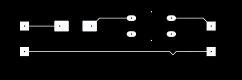
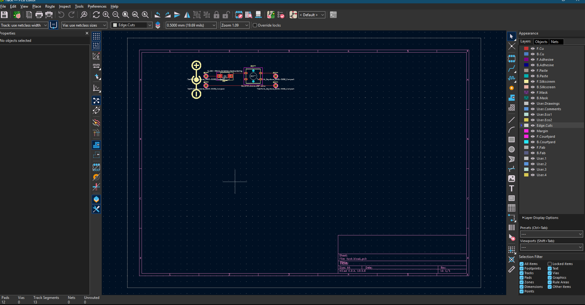

# Ground Zero

A small battery-powered high-voltage electronics project built around a compact high-voltage module.

## About

Ground Zero started as a simple warm-up hardware project. I wanted to take a basic high-voltage module and turn it into a complete project while learning circuit design and PCB design along the way.

The project includes the circuit design, physical wiring, testing, and documentation.

## Circuit Design

The circuit was first planned as a schematic in **KiCad**.

I used KiCad to:

* Draw the schematic
* Add and connect components
* Organize the circuit
* Check the design
* Prepare the design for PCB development

The final hardware was then assembled and tested based on the circuit design.

## Build

The physical build consists of:

* Battery
* High-voltage module
* Switch
* Wiring
* Insulation
* Mounting/enclosure materials

The high-voltage section is kept insulated and separated from accessible parts of the project.

## Photos

Photos of the project are included in the `images` folder.

Project structure:

```text
Ground-Zero/
├── README.md
├── docs/
│   └── project-notes.pdf
├── gerbers/
│   ├── hack-B_Cu.gbr
│   ├── hack-B_Mask.gbr
│   ├── hack-B_Paste.gbr
│   ├── hack-B_Silkscreen.gbr
│   ├── hack-Edge_Cuts.gbr
│   ├── hack-F_Cu.gbr
│   ├── hack-F_Mask.gbr
│   ├── hack-F_Paste.gbr
│   ├── hack-F_Silkscreen.gbr
│   └── hack-job.gbrjob
├── images/
│   ├── circuit.png
│   ├── schematic.png
│   ├── build.png
│   └── final.png
```

### Adding a photo

Place the photo inside the `images` folder and reference it in the README using:

```markdown

```

For example:

### Circuit


### Finished Build



## What I Learned

This project helped me learn:

* Basic circuit design
* KiCad schematic design
* PCB design concepts
* Component organization
* Physical wiring
* Circuit testing
* Hardware documentation

## Status

**Build complete**

The physical circuit has been assembled and tested. The KiCad schematic and project documentation are being developed alongside the build.

## Safety

This project contains a high-voltage circuit. The high-voltage output should remain insulated and should not be connected to a person. Testing should be performed using an appropriate non-human test setup.

## License

This project is provided for educational and experimental purposes.
